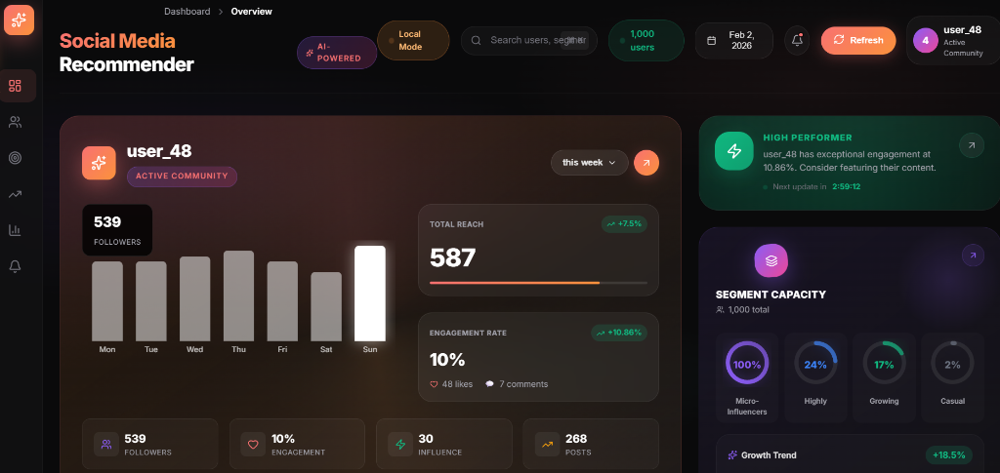
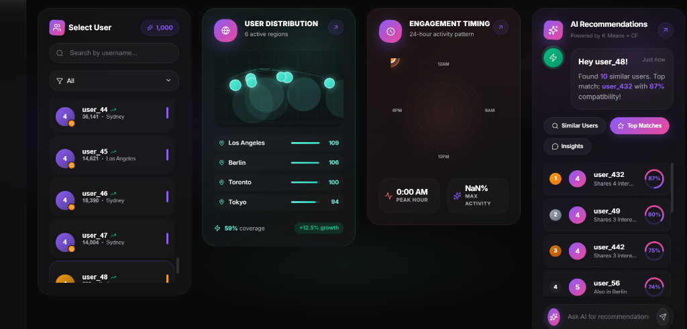
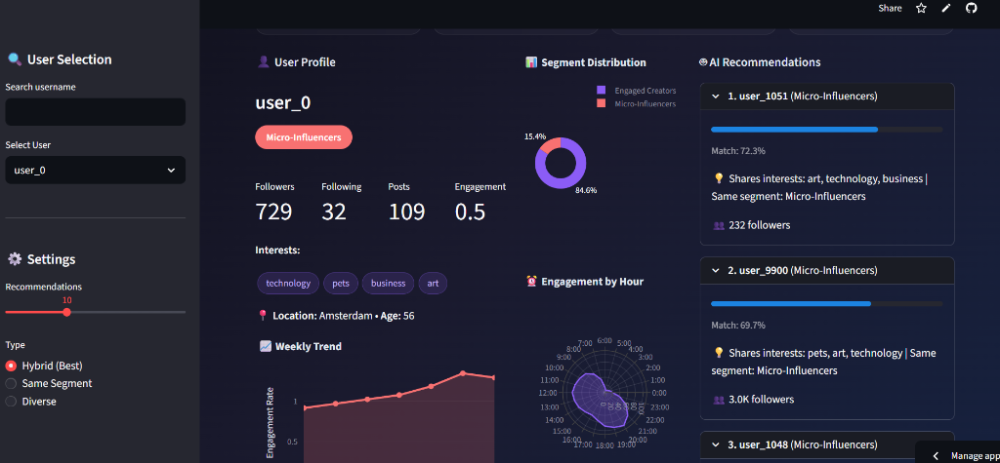

# 🎯 SocialAI Recommender

An end-to-end **social media account recommendation system** that uses machine learning to suggest relevant accounts to follow based on interests, engagement patterns, and user behavior.

[](https://socialmediarecommendationsystem.vercel.app)
[](https://social-media-recommendation-system-1.onrender.com/docs)
[](https://social-media-recommendation-system-srhj9xyjhbxkfs2wc6hi9w.streamlit.app/)


---

## 📸 Screenshots

### React Dashboard - Premium UI


### User Analytics & AI Recommendations


### Streamlit Analytics Dashboard


---

## 🌐 Live Deployments

| Service | URL | Description |
|---------|-----|-------------|
| **React Dashboard** | [socialmediarecommendationsystem.vercel.app](https://socialmediarecommendationsystem.vercel.app) | Premium animated UI |
| **API Backend** | [social-media-recommendation-system-1.onrender.com](https://social-media-recommendation-system-1.onrender.com) | REST API |
| **API Docs** | [/docs](https://social-media-recommendation-system-1.onrender.com/docs) | Interactive Swagger UI |
| **Streamlit** | [streamlit.app](https://social-media-recommendation-system-srhj9xyjhbxkfs2wc6hi9w.streamlit.app/) | Analytics dashboard |

---

## ✨ Features

- **Hybrid Recommendation Engine** - Combines cosine similarity (60%) + Jaccard similarity (40%) for high-quality recommendations
- **K-Means User Segmentation** - Automatically clusters users into behavioral segments
- **Dual Dashboard System**:
  - 🚀 **React Dashboard** - Premium UI with animations, engagement radar, global user map
  - 📊 **Streamlit Dashboard** - Interactive analytics with filter controls
- **FastAPI Backend** - REST API serving real ML pipeline data

## 🛠 Tech Stack

| Layer | Technologies |
|-------|-------------|
| **ML Pipeline** | Python, Scikit-learn, Pandas, NumPy |
| **Backend API** | FastAPI, Uvicorn, CORS |
| **React Frontend** | React 18, Vite, Framer Motion, Recharts |
| **Streamlit App** | Streamlit, Plotly |
| **Deployment** | Vercel, Render.com, Streamlit Cloud |

## 📈 ML Pipeline

1. **Data Generation** - Synthetic user profiles with realistic distributions
2. **Preprocessing** - Outlier removal, normalization, data cleaning
3. **Feature Engineering** - TF-IDF interests, engagement metrics, influence scores
4. **Segmentation** - K-Means clustering with optimal K selection (Elbow + Silhouette)
5. **Recommendations** - Hybrid similarity-based recommendations with explanations

## 🚀 Quick Start (Local Development)

```bash
# Clone the repository
git clone https://github.com/souravchandak11/Social-Media-Recommendation-System.git
cd Social-Media-Recommendation-System

# Create virtual environment
python -m venv venv
source venv/bin/activate  # Linux/Mac
venv\Scripts\activate     # Windows

# Install dependencies
pip install -r requirements.txt
cd app && npm install && cd ..

# Run ML pipeline (generates data + trains models)
python run_pipeline.py

# Start all servers
python -m uvicorn api.main:app --port 8000 &
streamlit run app/streamlit_app.py --server.port 8501 &
cd app && npm run dev
```

### Local Access URLs

| Service | URL |
|---------|-----|
| **React Dashboard** | http://localhost:5173 |
| **FastAPI Docs** | http://localhost:8000/docs |
| **Streamlit** | http://localhost:8501 |

## 📁 Project Structure

```
Social-Media-Recommendation-System/
├── src/                    # ML Pipeline modules
│   ├── data_generator.py   # Synthetic data generation
│   ├── data_preprocessing.py
│   ├── feature_engineering.py
│   ├── segmentation.py     # K-Means clustering
│   └── recommendation.py   # Hybrid recommendation engine
├── api/
│   └── main.py             # FastAPI backend
├── app/
│   ├── streamlit_app.py    # Streamlit dashboard
│   └── src/                # React frontend
├── docs/
│   └── images/             # Screenshots
├── data/
│   ├── raw/                # Generated data
│   ├── processed/          # Cleaned data
│   └── models/             # Trained models
├── run_pipeline.py         # End-to-end pipeline runner
└── requirements.txt
```

## 🎯 Use Cases

- **Data Science Portfolio** - Demonstrates end-to-end ML project
- **Interview Preparation** - Full-stack + ML architecture showcase
- **Learning Resource** - Recommendation system implementation
- **Template** - Starting point for similar projects

## 📊 Results

- **1,000 users** clustered into behavioral segments (cloud) / 10,000 locally
- **5 optimal segments** identified (Micro-Influencers, Engaged Creators, Rising Stars, etc.)
- **Hybrid recommendations** with explanation generation
- **Real-time API** serving ML predictions

---

## 🚀 Deployment

This project is deployed across three platforms:

1. **Vercel** - React frontend (static hosting)
2. **Render.com** - FastAPI backend (Python web service)
3. **Streamlit Cloud** - Analytics dashboard

---

Built with ❤️ using Python, React & Machine Learning
